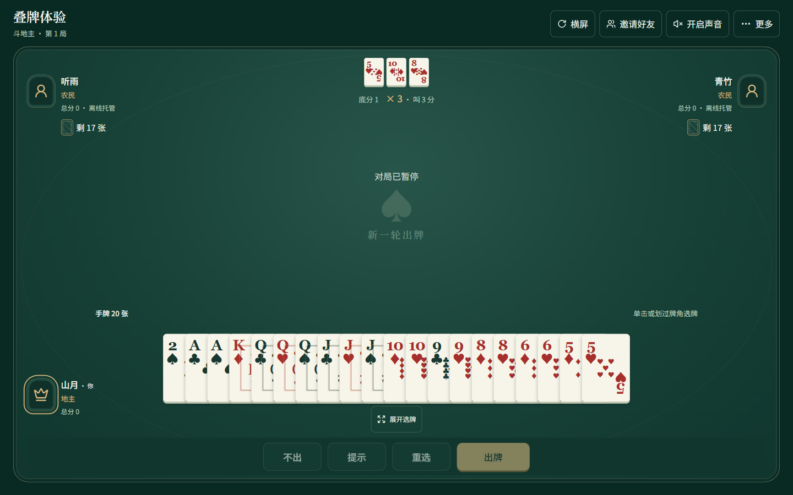
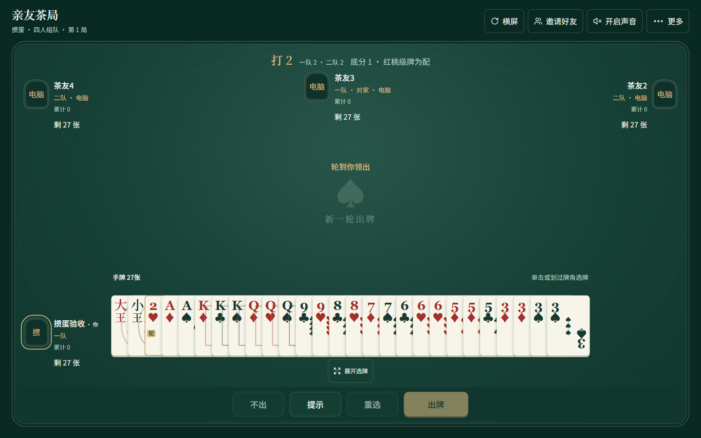

# 亲友娱乐 Hub

**源码公开展示 · 保留所有权利 · 当前版本 0.1.0**

本仓库仅供查看和了解项目。运行、修改使用、商业利用、分发和再发布本项目原创内容均须另行取得书面授权，详见 [LICENSE](LICENSE)。这是限制性源码查看声明，不是 OSI 认可的开源许可证。第三方依赖保留其原有许可，见 [第三方声明](THIRD_PARTY_NOTICES.md)。GitHub 平台条款允许的查看与 Fork 权利不受此声明限制。

供家人朋友线下聚会使用的局域网游戏平台。同一服务器可同时开四川麻将、斗地主和掼蛋房间。麻将为四人血战到底：不换三张、定缺、倍率制、自摸最后加一、可选封顶；斗地主为三人叫分制；掼蛋为四人两副牌、对家组队，支持级牌、红桃逢人配、炸弹/同花顺、接风、升级及进贡/还贡。三种玩法均支持电脑补位、离线声音和历史回放。

同一 Wi-Fi / 安卓热点内，一台 Windows 或安卓设备提供网页和服务器，其他人通过浏览器加入。所有网页、字体和麻将图形在本地提供，不需要互联网或账号。

## 功能与界面

| 玩法 / 能力 | 说明 |
| --- | --- |
| 四川麻将 | 四人血战到底、定缺、碰杠胡、倍率结算与流局查花猪 / 查大叫 / 退税 |
| 斗地主 | 三人叫分、电脑补位、划选与键盘选牌、离线报牌和牌型动画 |
| 掼蛋 | 四人双副牌、对家组队、级牌与逢人配、升级、进贡与还贡 |
| 联机 | 同一 Wi-Fi 或安卓热点，二维码 / 链接邀请、多房间并行 |
| 可靠性 | SQLite 存档、断线重连、电脑临时接管、原机重启后暂停恢复 |
| 记录 | 逐笔账单、整场排行、已结束牌局回放、CSV / JSON 导出 |
| 易用性 | 手机横竖屏、大字模式、减少动画、离线语音与音乐 |

以下为项目浏览器界面截图，部分布局压力测试使用模拟数据；不代表实体手机验收。





## 项目状态

项目处于开发预览阶段，提供 Windows / Android 原生主机和浏览器客户端。安卓预览包采用开发签名；安卓后台 / 锁屏 / 热点、双厂商手机及 iPhone Safari 等仍需实测，构建成功不等于真机验收通过。已有验证及限制见 [验收记录](docs/verification.md)。

本次 GitHub 发布包含源码、文档、截图和离线资源。`artifacts/` 中的本机安装包、工具链、数据库与构建输出不上传；本仓库尚未发布可下载的 Release 安装包。

## 开发运行

以下步骤供权利人及已取得相应授权的开发者使用，文档本身不授予运行或修改许可。

需要 Node.js 22+（CI 使用 24）、npm 和 Rust stable。Windows 推荐 Visual Studio C++ Build Tools + Windows SDK；Android 另需 JDK 21、Android SDK / NDK，具体版本和步骤见 [原生构建说明](docs/native.md)。初次安装依赖需要网络，运行时的网页、字体与声音均在本地提供。

先获取源码并进入目录：

```powershell
git clone https://github.com/makerY666/qinyou-entertainment-hub.git
cd qinyou-entertainment-hub
```

构建网页后启动服务器。服务器会将 `web/dist` 嵌入可执行文件，必须先构建网页：

```powershell
npm ci
npm --prefix web ci
npm run web:build
cargo run -p hub-server -- --port 18765 --data-dir .data
```

打开终端显示的局域网链接。`http://127.0.0.1:18765` 只适用于主机自己，分享给其他设备时必须使用主机的局域网 IP。开发界面热更新可另开终端运行 `npm run web:dev`，访问 `http://localhost:5174`，它将 API 代理到 18765。

若本项目已准备了 `.tools` 本地 Rust，Windows 可直接运行：

```powershell
powershell -File scripts/dev.ps1 -Action host
```

`.tools/` 是可选的本地工具链目录，不包含在仓库中；普通开发环境可直接使用标准 npm / Cargo 命令。

## 使用流程

给第一次使用的亲友：[简明使用说明](docs/使用说明.md)。

1. 安装客户端并启动服务，或运行上述独立服务器。
2. 输入昵称，创建房间时选择四川麻将、斗地主或掼蛋，设置底分、计时和封顶。
3. 将二维码或链接分享给同一网络的朋友。空座可以加入电脑。
4. 麻将四人准备后定缺、摸打、碰杠胡；斗地主三人准备后叫分、领取底牌、轮流出牌；掼蛋四人准备后隔座组队，每人27张，出完升级，下局进还贡。扑克玩法点选手牌后点击出牌按钮。
5. 结算后可继续下一局；历史页面提供账单、回放与 CSV/JSON 导出。

断线 60 秒后电脑临时接管，原浏览器重连可以取回。主机意外关闭后，原设备重新启动会恢复为暂停状态，房主点击继续。主机 IP 改变或清除浏览器数据后，可复制新身份 ID 请房主确认恢复原座位。

斗地主详细玩法和接口见 [斗地主与混合房间](docs/doudizhu.md)。
掼蛋详细规则、界面、64条离线语音和验证记录见 [四人掼蛋](docs/guandan.md)。

## 麻将规则

| 项目 | 倍率 |
| --- | --- |
| 平胡 | 1 |
| 大对子 | 2 |
| 清一色 | ×4 |
| 七对 | 4，与大对子互斥 |
| 每根 | ×2 |
| 杠上花、杠上炮、抢补杠胡 | 对应情境 ×2 |
| 自摸 | 所有相乘后 +1 |

清一色与大对子/七对及根叠加，龙七对按七对和根计算。金钩钓不额外加倍。胡牌单笔金额为底分乘最终倍率，再按房间可选的 8/16/32/64 倍封顶，默认不封顶。胡牌后退出后续普通收付。

直杠由放杠者付 2 倍；补杠其他未胡者各付 1 倍；暗杠其他未胡者各付 2 倍。牌墙摸完才查花猪、查大叫并退税。花猪默认向每位非花猪付 16 倍（可选 8/32），包括已胡者；花猪不重复查大叫。未听牌者向听牌者赔最高合法成牌倍率，不含自摸或情境奖励。花猪及未听牌者退还收到的全部杠分。

## 构建与验证

```powershell
cargo test -p mahjong -p doudizhu -p guandan -p hub-server
node --test web/tests/*.test.mjs
npm run web:build
cargo build -p hub-server --release
node scripts/verify-host-recovery.mjs target/release/hub-server.exe
```

原生客户端步骤见 [原生构建说明](docs/native.md)，接口见 [协议说明](docs/protocol.md)，电脑算法与基准见 [电脑策略](docs/bot-strategy.md)，实际验证状态见 [验收记录](docs/verification.md)。`.github/workflows/build.yml` 在推送、Pull Request 或手动触发时执行 Windows / Android 构建，并上传 Actions 构建产物；不会自动创建 GitHub Release。

## 目录

- `crates/mahjong`：确定性规则引擎、隐私投影、机器人、记分及测试。
- `crates/doudizhu`：斗地主叫分、牌型、隐私投影、机器人、零和结算及测试。
- `crates/guandan`：四人组队、配牌、升级进贡、接风、机器人、隐私及零和结算。
- `crates/hub-server`：HTTP/WebSocket、房间、身份、事务存档与离线网页服务。
- `web`：三端共用的 React 界面。
- `apps/native`：Tauri 桌面壳、安卓 JNI 和前台服务。
- `.ulpi/design`：锁定的视觉与交互规范。

存档位于独立服务器指定的 `--data-dir`，原生客户端使用应用数据目录。备份请先正常停止服务，再复制整个数据目录；不要只在运行中复制 SQLite 主文件而漏掉 WAL。客户端卸载或主机丢失不会自动从其他设备找回历史。

## 网络与范围

局域网设备必须能互相访问；酒店、访客 Wi-Fi 的 AP 隔离会阻止连接。Windows 需允许该程序在私有网络接收入站连接。安卓主机可在系统设置中手动开启热点，应用读取可用地址，不会擅自修改热点密码。主机切后台使用前台服务，系统强制停止或省电策略仍可能中断，需在真实设备上验收。

首版不提供公网匹配、支付、语音聊天、云同步或自动主机迁移。牌桌提供离线中文报牌、操作语音与背景音乐。不要把局域网 HTTP 服务通过端口映射暴露到公网。

## 反馈与授权

问题反馈和授权请求可通过 [GitHub Issues](https://github.com/makerY666/qinyou-entertainment-hub/issues) 联系维护者。提交反馈不会自动取得商用、运行、修改或再发布授权。请勿在公开 Issue 中上传真实对局数据库、身份令牌、个人信息或签名密钥。

本项目原创内容采用 [源码查看与权利保留声明](LICENSE)，不采用 MIT、Apache-2.0、GPL 或 AGPL 对原创内容授予开源使用许可。第三方材料分别遵循 [其自身许可](THIRD_PARTY_NOTICES.md)。
