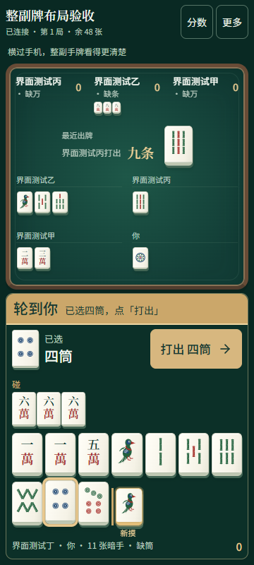
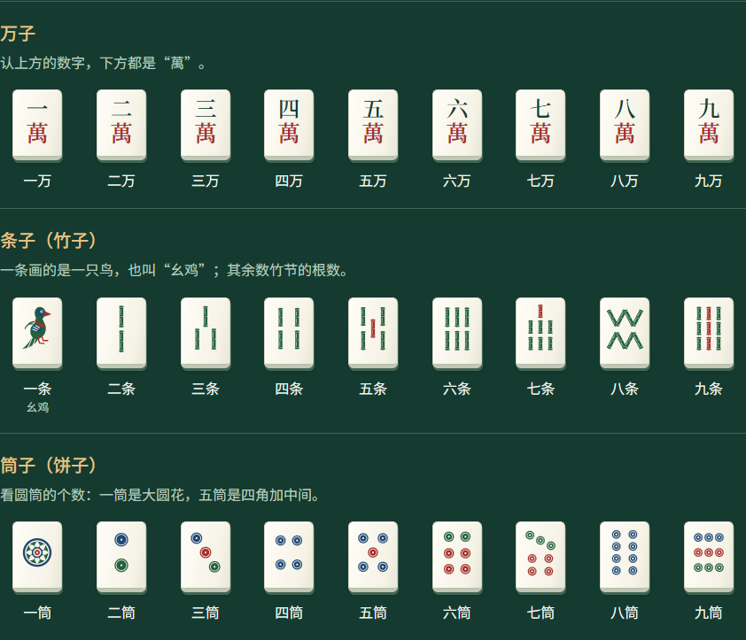

# 亲友娱乐 Hub 使用说明

一台电脑或安卓手机开房，其他亲友用浏览器加入。所有设备连同一个 Wi-Fi；也可以连接开房安卓手机的热点。

## 第一次使用

**开房的人**安装 Windows 客户端或安卓 APK。打开应用，点击「启动服务」，再点「开一桌」。输入昵称与房间名称，保留默认规则即可开始。

**加入的人**不用安装。扫描房主提供的二维码，或在浏览器打开邀请链接，输入自己的昵称，选一个空座并准备。

创建牌桌时可选择四川麻将、斗地主或掼蛋。麻将和掼蛋需四人，斗地主需三人；不足时房主可以添加电脑玩家，所有座位准备好后由房主开始对局。

本次安卓安装文件为开发签名测试 APK；不需要商店账号。实体手机的后台、锁屏及热点行为仍须按验收记录实测。Windows 安装器带离线 WebView2 安装资源；正常游玩不需要联网下载网页或字体。

## 开一桌给家人玩

1. 所有人连同一个 Wi-Fi。如果用安卓手机开热点，其他人都连接这个热点。
2. 开房设备打开应用并「启动服务」。端口默认 18765，提示被占用时换一个端口再启动。
3. 「开一桌」，输入昵称与桌名。底分默认 1、不封顶、出牌 30 秒、响应 15 秒，也可以关闭计时。
4. 在牌桌顶部直接点「邀请好友」。有多个网络地址时，选正在使用的 Wi-Fi 地址，其他人扫描二维码。
5. 人齐后开始。其他亲友准备、房主开局；不足的人数由电脑补位。

房主是负责这一桌的人；主机管理员是提供服务的设备，能够管理多桌。浏览器中的朋友也可以另外开一桌。

## 一局怎么操作

以下为四川麻将操作。斗地主见[斗地主说明](doudizhu.md)，四人掼蛋见[掼蛋说明](guandan.md)。掼蛋在大厅选择「四人组队」，隔座为对家；点选或划选手牌后「出牌」，也可「提示」或「不出」。红桃级牌标「配」，还贡阶段只显示可以还的牌。音乐、出牌语音和音效可在「更多」中分别调整，首次播放点「开启声音」。

**先定缺。** 在万、条、筒中选一门，通常选手里数量较少的那门。缺门的牌要先打完，才能胡牌。首版不换三张。

**轮到自己时。** 牌桌显示醒目的「轮到你」。点一下手牌，再看选中的牌名与放大预览，确认无误后点「打出」。点牌只会选中，不会立刻打出。手机推荐横屏，整副手牌在底部一次显示；竖屏分两行，不需要左右找牌。

**切换横屏。** 点牌桌顶部醒目的「横屏」按钮。支持的手机浏览器会尝试全屏并锁定横屏；可以用同一个按钮退出。浏览器不允许自动转向时，会弹出操作提示：关闭手机竖屏锁定，再横过手机。进入全屏后仍能打开「邀请好友」扫码或复制链接。小屏把看大牌、分数和声音设置收在「更多」，横屏与邀请保持直接可见。

**看整副牌。** 自己的碰、杠就在手牌旁边。刚摸进来的那张牌放在最右侧，带「新摸」标记；打牌后标记消失，碰牌后不会虚构一张新摸牌。

**看别人打过的牌。** 各玩家的「碰杠」和「弃牌」分别显示，不混在一起。桌面牌河会换行；牌多时可在该区域滚动。手机点击某家的「碰杠 N 组／点击看全」，或顶部「看大牌」，可按玩家放大查看公开牌。其他人的暗杠仍显示牌背，不会泄露暗牌。

**别人打牌时。** 只有合法操作才会出现。可以碰、杠、胡，不可以吃；不操作就点过。牌桌会提示当前轮到谁以及需要做什么。

**碰杠胡与收付提示。** 每位玩家的碰、杠、胡牌都会在全桌显示姓名和行为动画；有分数变化时，同时显示各人的正负变化。点收付记录可查看谁付给谁、金额与原因。静音不会隐藏这些提示；减少动画仍保留文字和分数。

**胡牌以后。** 继续看本桌公开牌局，不再参与本局后续摸打和普通收付。三人胡牌或牌墙摸完时结束。整局结束后才能看其他人的暗牌回放。

看不清时打开大字显示；「玩法」里可查看万、条、筒的完整牌面。可减少动画。电脑上可用 Tab 移动焦点，Enter 或空格选择按钮。

**声音。** 点击「开启声音」后，可听带鼓点和旋律变化的对局音乐、中文报牌及碰杠胡提示。音乐、语音、音效各有开关和音量；静音可一次关闭全部声音。声音资源离线提供，网页切到后台时暂停音乐。浏览器限制自动播放时，需先点击一次页面或「开启声音」。

**电脑玩家。** 新策略会比较听牌距离、可用进张和公开牌风险，并权衡碰杠是否破坏牌型；不会读取对手暗手或真实牌墙。计分规则保持原样。

手机选牌界面（实际浏览器截图）：

完整牌面图：

## 分数与历史

分数由主机自动计算，不需要手动记账。「分数」可以查看逐笔收付和整场排行。胡牌分按底分乘最终倍率计算，自摸在其他倍率相乘后加 1，最后应用封顶。

麻将每局结束后自动展示本局结算。每人可查看自己的净变化、收入、支出、累计分数，并展开逐笔原因。四个人都点「确认本局分数」后，房主才可开始下一局；确认也表示已准备下一局，不用再重复准备。电脑自动确认，断线的真人需要重连后确认。关闭面板不等于确认，可从牌桌重新打开。确认状态保存在主机，刷新或原机重启不会丢失。

本局开始后规则固定。修改设置只对下一局生效。直杠、补杠、暗杠单独计分；只有牌墙摸完才执行查花猪、查大叫和退税。提前中止保留已发生收付，不追加流局罚分。

结束后从「对局记录」打开回放，可逐步前进、后退、播放或拖动进度，也可切换玩家/全局视角。CSV 用于查看账单，JSON 保存规则版本与完整回放数据。删除记录需要确认。

## 断线或关机后

- 手机短暂切走、网络掉线：回到原浏览器页面即可尝试重连。掉线座位保留；60 秒后电脑临时接管，重连后交回控制。
- 房主电脑或手机意外退出：重新打开原设备的应用并启动服务，已保存牌桌会恢复为暂停，由房主继续。
- 主机地址变化：重新分享新二维码。浏览器换地址后无法读到原凭据时，先建立新身份，再由房主确认重新绑定原座位。同名不能直接取回座位。
- Windows 关闭窗口会留在托盘继续服务；要结束服务请从应用或托盘主动停止。安卓开房时保持前台服务通知，系统强制停止应用会中断开房。

历史保存在开房的原设备，其他设备不会自动备份。要备份时先停止服务，再复制完整数据目录。独立服务器的数据目录由 `--data-dir` 指定，客户端使用系统应用数据目录。

## 常见问题

| 现象 | 操作 |
| --- | --- |
| 自己能打开，亲友打不开 | 确认大家在同一 Wi-Fi/热点；分享局域网 IP，不能分享 `127.0.0.1` 或 `localhost` |
| Windows 第一次开房无法加入 | 检查系统防火墙是否允许该程序在专用网络接收入站连接 |
| 换了 Wi-Fi 后旧二维码打不开 | 刷新主机地址，重新打开「邀请好友」分享 |
| 酒店或访客 Wi-Fi 互相打不开 | 该网络可能隔离设备；改用家庭 Wi-Fi 或手机热点 |
| 安卓提示没有局域网权限 | 在应用权限设置中允许局域网访问，然后重新启动服务 |
| 提示操作过期 | 等待页面刷新当前局面，再选择操作，避免重复点按 |
| 手机打牌区域较紧 | 点牌桌顶部「横屏」；浏览器不支持自动转向时按提示关闭竖屏锁定并横过手机 |

更多规则见项目 README；已完成和待完成的设备测试见 [验收记录](verification.md)。
